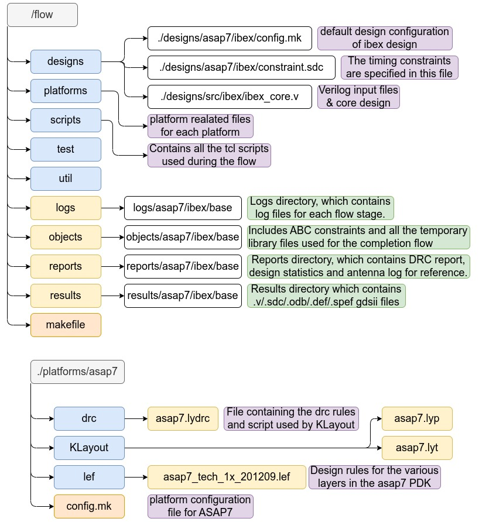

# OpenROAD & VSD - 7nm PD Contest

This repository is designed to log my learnings and work during the contest.

The best guide can be found at the OpenROAD Flow Scripts tutorial [here](https://openroad-flow-scripts.readthedocs.io/en/latest/tutorials/FlowTutorial.html#introduction)

##  OpenROAD & Flow controllers

**OpenROAD** is an integrated chip physical design tool that takes a design from from RTL to GDSII, including synthesis, floorplanning, placement, routing, signoff parasitic extraction and timing analysis. 

It uses a hierarchical placement algorithm that aims to minimize wire length, and it provides several features to optimize timing and power consumption. OpenROAD is designed to be extensible and customizable, with a flexible architecture that allows users to add their own algorithms and features.


The OpenROAD project supports two main flow controllers.

1) - **OpenROAD-flow-scripts(ORFS)** is a flow controller that provides a collection of open-source tools for automated digital ASIC design from synthesis to layout. It provides a fully automated RTL-to-GDSII design flow, which includes Synthesis, Placement and Routing (PnR), STA (Static Timing Analysis), DRC (Design Rule Check) and LVS (Layout Versus Schematic) checks. ORFS aims to provide a flexible and customizable environment for digital ASIC design, allowing users to choose and combine different tools as needed. 

   - In ORFS, OpenROAD is used as a plugin for the physical design stage, and it can be configured and customized to meet the specific needs of the design project. The OpenROAD plugin in ORFS provides access to several advanced features, such as hierarchical placement, global routing, and detailed routing optimization.

   - ORFS  supports several public and private PDKs (under NDA). Available public PDK's are GF180, Skywater130, ASAP7 etc.

2) **OpenLane** is a complete automated RTL-to-GDSII flow similiar to ORFS and is developed by Efabless for the skywater130 MPW Program 


> More about the OpenROAD Project can be found [here](https://openroad.readthedocs.io/en/latest/main/README.html)

## Brief process of ORFS (or RTL to GDSII in general)

- Configuration: Once ORFS is installed, you can configure the framework to meet the specific needs of your design project. This involves specifying the design parameters, such as the target technology node, the design constraints, and the tool settings.

- Design entry: You can enter the design into ORFS in different ways, depending on your design entry method. ORFS supports different input formats such as Verilog

- Synthesis: The synthesis stage involves transforming the RTL design into a gate-level netlist. ORFS includes several open-source synthesis tools, such as Yosys and ABC, which can be used for this stage.

- Floorplanning: In the floorplanning stage, the placement of the different design modules within the chip area is determined. ORFS includes several floorplanning tools, such as RePlAce and Capo, which can be used for this stage.

- Placement: The placement stage involves determining the exact location of each gate or cell within the chip area. ORFS includes several placement tools, such as OpenROAD, which can be used for this stage.

- Routing: The routing stage involves connecting the gates and cells using metal wires to form a complete circuit. ORFS includes several routing tools, such as FastRoute and TritonRoute, which can be used for this stage.

- Layout verification: After the routing stage, the design is verified for layout correctness using tools such as Magic, which is included in ORFS.

- GDSII generation: Once the design is verified, the final GDSII layout file is generated using ORFS tools such as Magic and KLayout.

## Installing and setting up ORFS

The best resource for setting up the toolchain can be found [here](https://openroad-flow-scripts.readthedocs.io/en/latest/user/BuildLocally.html). A shorter version of the steps  is documented below.

Clone repository
```
git clone --recursive https://github.com/The-OpenROAD-Project/OpenROAD-flow-scripts
```
Install dependency using internal script ( It takes care of all the additional packages)
```
cd OpenROAD-flow-scripts
sudo ./etc/DependencyInstaller.sh
```
Build & Install ( This  installs all the required scripts and the OpenRoad tool as well)
```
./build_openroad.sh --local
```

Verify Installation
```
source ./setup_env.sh
yosys -help
openroad -help
exit
```

> Make sure that to remember the location of where the ORFS repository is cloned and every time a new terminal is launched, the `setup_env.sh` file is sourced.


## Updating ORFS

ORFS is constantly evolving and it is a good idea to update the files from time to time. To update the ORFS files execute the commands below 

```
cd OpenROAD-flow-scripts
git checkout master
git pull
git submodule update
./build_openroad.sh --local --clean
```


## The really simple way for RTL to GDSII!!!

To understand the beauty of the OpenROAD Flow scripts, below are the really simple steps to generate the GDSII files for the `ibex` RISC V processor and the `ASAP7` PDK.

> More about the ibex RISC V processor can be found [here](https://github.com/lowRISC/ibex)

Change your current directory to the flow directory.
```
cd flow
```
The automatic flow is based on the `Makefile` setup, `config.mk` from `designs` folder and `config.mk` from `platforms` folder.  
The `Makefile` contains the stages of the flow and this is very easy to track and understand.  
For advanced users the `scripts` folder contains more detailed scripts that control the flow.  

Uncomment the ` DESIGN_CONFIG=./designs/asap7/ibex/config.mk` line in the makefile

```
# DESIGN_CONFIG=./designs/asap7/gcd/config.mk
 DESIGN_CONFIG=./designs/asap7/ibex/config.mk
# DESIGN_CONFIG=./designs/asap7/aes/config.mk
```
>Note: this is only for the `ibex` processor using `asap7`, other designs will have their other respective design files

run make

```
make
```

It took about 15 minutes on my machine to have the final gds and the process completes with the message.
 
 ```
[INFO] Writing out GDS/OAS 'results/asap7/ibex/base/6_1_merged.gds'
Elapsed time: 0:03.43[h:]min:sec. CPU time: user 2.85 sys 0.29 (91%). Peak memory: 551844KB.
cp results/asap7/ibex/base/6_1_merged.gds results/asap7/ibex/base/6_final.gds

 ```

> The build time is highly dependent on the system hardware. The desktop for the above tests contains 8 cores and 12 Gb of ram 

The automatic flow it generates by default `.odb` files for the final result, in case `.def` files are needed the make command must contain `-def` switch.


## Interactive commands
OpenROAD offers an interactive mode to analyse the different steps: 

```
make DESIGN_CONFIG=.<PATH>/config.mk <command>`   
<command> :synth, floorplan, cts, gui_<stage> etc. 
```

In case at a particular stage a modification is needed, the `designs/../config.mk` can be modified and the effect can be analyses.  

The gui is launched using:

 ```
 make gui_<stage>
 
 <stage>: synth, floorplan, cts etc. 
 ```
## Stages - usefull info 
1. Synthesis - check logs for details regarding the tools and parameters, results for list of components and timings
2. Floorplan  
- IO placement, macro place, tapcell place, pdn creation 
- <ORFS_PATH>/platforms/<PDK_NAME>/openRoad/pdn/grid_strategy-M2-M5-M7.tcl - can be used to understand the grid strategy

4. Place - will do :IO placement, global gate place, resizer (for optimization) , detailed placement 
5. CTS -  synthesize clock buffers to balance and meet the timings and skew 
6. Routing - Global routing (FastRoute) defines min-max layers, and checked congestion , detailed routing (TritoneRoute) completes all connections based on track assignments and IO place, tries to fit in the DRC rules. 
7. Final step: parasitic extraction using Open OCX , final timming checks and sign off 
   - statistics and reports can be checke in the `reports` folder
8. DRC and LVS checks are done with files exported from Klayout

## Understanding the directory structure




## Understanding and viewing Reports

The three major metrics to understand the performance and functionality of the design are
- Timing ( Target -> worst negative slack = O)
- Power  ( Lower the better)
- Design Area ( Lower the better )

The metrics can be analyed from the reports/logs folders or interactivly in the GUI. 

### Reporting and understanding the timing results

Use the following commands in the Tcl Commands section of GUI:

```
report_worst_slack
report_tns
report_wns
```

An example of the reported Timing results is
```
worst slack -107.32
tns -870.89
wns -107.32
```
> Note the timing constraints in this situation are not met.


- Negative Slack (NS): Negative slack is the amount of time by which a signal arrives later than it is required to arrive at a particular point in the circuit. It is calculated as the difference between the required arrival time and the actual arrival time of a signal. A negative slack value indicates that the circuit is not meeting its timing requirements and may result in timing violations.

- Worst Negative Slack (WNS): Worst negative slack (WNS) is the most negative value of the slack across all paths in the circuit. It represents the worst-case timing violation in the circuit.

- Total Negative Slack (TNS): Total negative slack (TNS) is the sum of all the negative slack values across all paths in the circuit. It represents the overall timing violation in the circuit.


### Reporting and understanding power usage 

The power is reported by 
```
report_power
```

An example of the reported power is 

```
Group                  Internal  Switching    Leakage      Total
                          Power      Power      Power      Power (Watts)
----------------------------------------------------------------
Sequential             1.36e-03   2.68e-04   2.39e-07   1.63e-03  13.4%
Combinational          4.35e-03   6.11e-03   1.99e-06   1.05e-02  86.6%
Macro                  0.00e+00   0.00e+00   0.00e+00   0.00e+00   0.0%
Pad                    0.00e+00   0.00e+00   0.00e+00   0.00e+00   0.0%
----------------------------------------------------------------
Total                  5.70e-03   6.38e-03   2.23e-06   1.21e-02 100.0%
                          47.2%      52.8%       0.0%

```

- Sequential Power Usage: Sequential power usage refers to the power consumed by the flip-flops and latches in a circuit. These elements store the state of the circuit, so they consume power even when the circuit is not actively switching. 

- Combinational Power Usage: Combinational power usage refers to the power consumed by the logic gates and interconnects in a circuit. These elements do not store any state, so they only consume power when the circuit is actively switching. 

- Macro Power Usage: Macro power usage refers to the power consumed by large IP blocks or subcircuits in the design. These blocks are typically provided by third-party vendors and can have a significant impact on the overall power consumption of the chip.

- Pad Power Usage: Pad power usage refers to the power consumed by the input/output (I/O) pads of the chip. These pads interface the chip with the outside world and are typically designed to meet specific electrical standards. 

### Reporting Area Utilization

View design area and its core utilization:

```
report_design_area
```

An example of the reported area is 

```
Design area 2489 u^2 45% utilization.
```

## GUI
### CTS 
To select the clock nets use `Find` with clock names and filter `Nets` items.  


Selecting `Timing Report` tab on the right hand side of the GUI will list the timings related to selected clock nets.  


### Floorplan and routing
For placement and routing the `Heat maps` f0r `Placement congestion` and `Routing congenstion`

### Final design
Cab be explored also for timings and congestion.  
Additional to open the final design in Klayout can be used the following command :  
`klayout -e -nn ./platforms/asap7/KLayout/asap7.lyt -l ./platforms/asap7/KLayout/asap7.lyp ./results/asap7/ibex/base/6_final.gds `

## Macro placement
```
export SYNTH_HIERARCHICAL = 1
export RTLMP_FLOW = True

# RTL_MP Settings
export RTLMP_MAX_INST = 30000
export RTLMP_MIN_INST = 5000
export RTLMP_MAX_MACRO = 16
export RTLMP_MIN_MACRO = 4
export ADDITIONAL_LEFS = $(PLATFORM_DIR)/lef/fakeram45_256x16.lef
export ADDITIONAL_LIBS = $(PLATFORM_DIR)/lib/fakeram45_256x16.lib
export PLACE_PINS_ARGS = -exclude left:0-500 -exclude left:1000-1500: -exclude right:* -exclude top:* -exclude bottom:*
export MACRO_PLACE_HALO = 10 10
export MACRO_PLACE_CHANNEL = 20 20

```
## Quality of Results  
OpenROAD enables QoR tracking trough metrics 2.1 feature.
https://openroad-flow-scripts.readthedocs.io/en/latest/contrib/Metrics.html

The logging infrastructure supports generating a JSON file containing design metrics (e.g., area or slack).  
To keep track of the quality of the results, we maintain inside each design folder two files:  
- `metadata-base-ok.json` which contains all the relevant information extracted from the “golden” execution of the flow (i.e., last known good result).
- `rules.json` which holds a set of rules that we use to evaluate new executions when a change is made.  

Command to compare the results: `make metadata`  
If all the metrics are passed you can tighten the rules by updating `make update_ok`.  

## Autotuner
Autotuner is an open, ML-based, hyperparameter framework and engine to the OpenROAD RTL-GDSII flow.  The  AutoTuner is an autonomous, parameter tuning framework using Ray (https://www.ibm.com/cloud/blog/ray-on-ibm-cloud-code-engine) for commercial and academic RTL-to-GDS flows.  
https://openroad-flow-scripts.readthedocs.io/en/latest/user/InstructionsForAutoTuner.html  

Setup for local installation:
```
pip3 install -U --user 'ray[default,tune]==1.11.0' ax-platform hyperopt nevergrad optuna pandas
pip3 install -U --user colorama==0.4.4 bayesian-optimization==1.4.0
```
Setup for cloud : 
https://github.com/The-OpenROAD-Project/OpenROAD-flow-scripts/tree/master/tools/AutoTuner  
Autotuner runs from `flow/util` directory - check the documentation.  
```
python3 distributed.py --design ibex --platform asap7 \
                       --config ../designs/asap7/ibex/autotuner.json \
                       tune

```
Results:  
After running Autotuner we have a best performance indication and the output is logged into `/logs/<technology>/<design_name>/<test-tune-date-time_dir>/autotuner-best-xxx-.json` file.  

```
2023-03-16 21:42:38,137	INFO tune.py:747 -- Total run time: 2025.49 seconds (2025.35 seconds for the tuning loop).
[INFO TUN-0002] Best parameters found: {'_SDC_CLK_PERIOD': 435.7520794150866, 'CORE_UTILIZATION': 41, 'CORE_ASPECT_RATIO': 0.6047398852650901, 'CORE_MARGIN': 2, 'CELL_PAD_IN_SITES_GLOBAL_PLACEMENT': 1, 'CELL_PAD_IN_SITES_DETAIL_PLACEMENT': 2, '_FR_LAYER_ADJUST': 0.30103473460489677, 'PLACE_DENSITY_LB_ADDON': 0.9565761927656559, '_PINS_DISTANCE': 1, 'CTS_CLUSTER_SIZE': 178, 'CTS_CLUSTER_DIAMETER': 247, '_FR_FILE_PATH': '', '_FR_GR_OVERFLOW': 1}
(save_best pid=16074) [INFO TUN-0003] Best parameters written to /home/mihaih/OpenROAD-flow-scripts/flow/logs/asap7/ibex/test-tune-2023-03-16-21-08-49/autotuner-best-fdb920f6.json

```
This file can be used with tensorboard gui `tensorboard --logdir = <logpath>` and open the provided url.   


## Issues 
Can be generated on github but must contain an test case document.  
This can be obtained with `make <stage>_issue`.  <stage> - the name of the tcl file from `/scripts` folder.  
